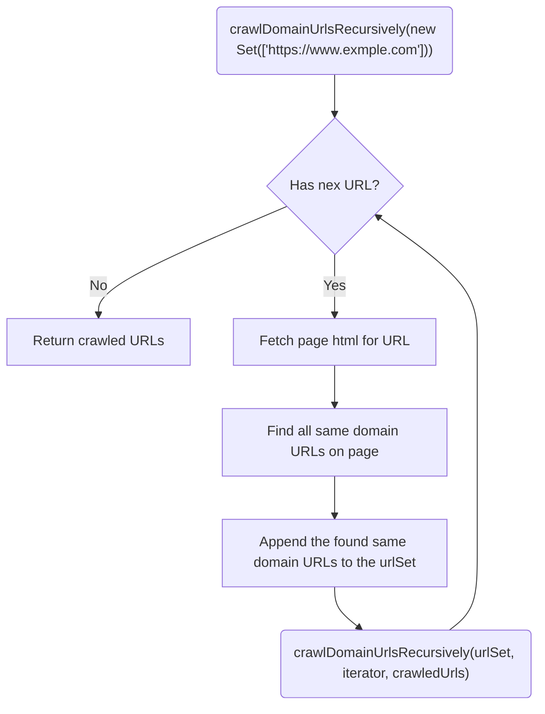
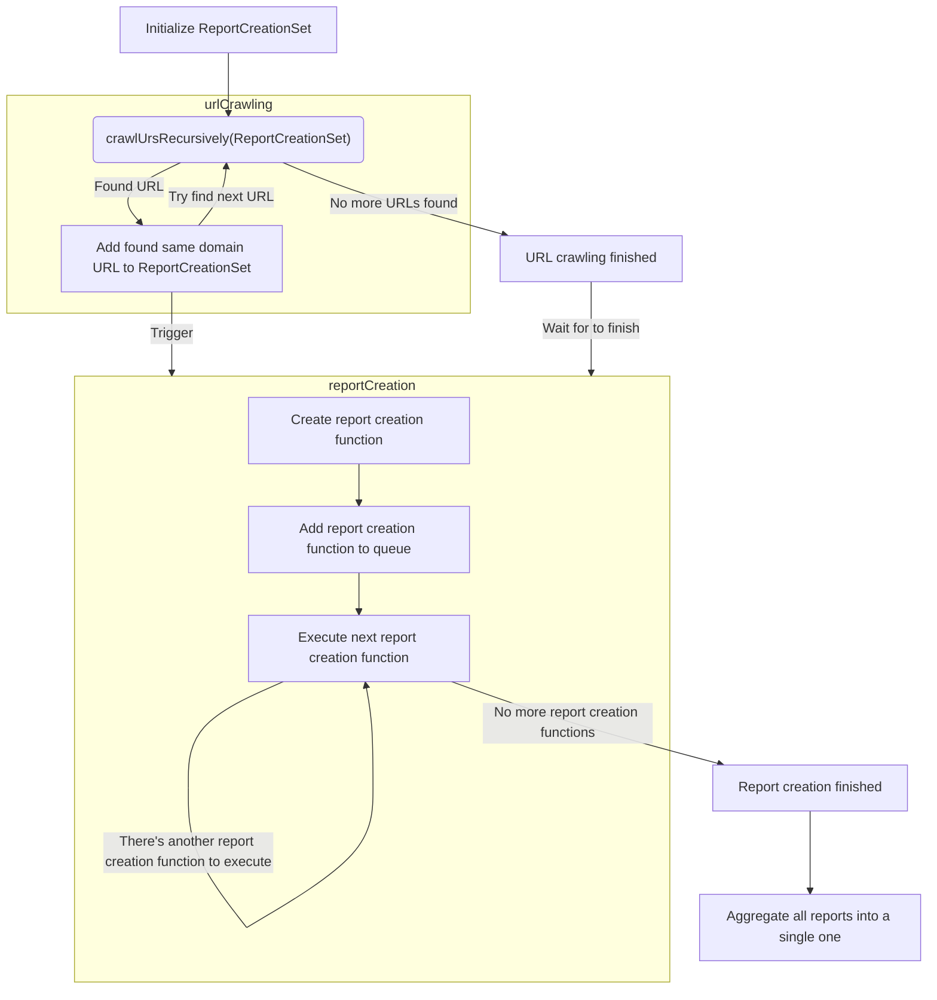

# 🏛️ Backend

The Backend uses the following technologies:

- [Express.js](https://expressjs.com/de/): Used to provide an API.
- [Playwright](https://playwright.dev/): Used to create a screenshot of a given website.
- [IBM's Accessibility Checker](https://www.npmjs.com/package/accessibility-checker): Used to check that a source (can be a URL, a file or simply an HTML string) complies with the WCAG.
- [Cheerio.js](https://cheerio.js.org/): Used for crawling the HTML of a website.

## Important files/folders:

- _[routeHandlers/](./routeHandlers/)_: As the name already suggests, this folder contains the route handlers for the API endpoints defined in the [server.ts](server.ts)
  - _[utils/](./routeHandlers/utils/)_: Contains basic logic for the form validation for the API endpoints
- _[utils/](./utils/)_: Contains the logic for URL crawling and report generation that's used in the route handlers.
  - _[report-generation/](./utils/report-generation/)_
    - _[crawlDomainUrlsRecursively.ts](./utils/report-generation/crawlDomainUrlsRecursively.ts)_: Recursively crawls all the URLs of a domain. ([Url Crawling](#url-crawling))
    - _[generateMultiPageReport.ts](./utils/report-generation/generateMultiPageReport.ts)_: Uses the recursive URL crawling to create an aggregated report for all found pages. ([Report Generation](#report-generation))
    - _[report-aggregation/](./utils/report-generation/report-aggregation/)_
      - _[README.md](./utils/report-generation/report-aggregation/README.md)_: Contains further explanation on how the report aggregation works.
  - _[takeScreenshot.ts](./utils/takeScreenshot.ts)_: Uses _Playwright_ to create a screenshot of a Website for a given URL.
- _[server.ts](server.ts)_: The entry point to the Backend server. Creates the _Express.js_ application and defines the API endpoints.

## URL Crawling

The URL crawling is done via recursion in the [crawlDomainUrlsRecursively.ts](./utils/report-generation/crawlDomainUrlsRecursively.ts). We start with a `Set` that contains a single URL and from there on we use the `Set`'s iterator to recursively crawl the next URLs by following these steps:

1. Request the HTML for the URL that the `Set`'s iterator points to.
2. Find and store all URLs of anchors (`<a href="https://www.example.com/foo/bar">`) on this page that link to the same domain by following these steps:
   1. Filter out links that fulfill the following criteria
      1. Contain special _prefixes_:
         1. _#_ links to the same page
         2. _mailto:_ or similar prefixes link to no page at all
      2. Contain special _infixes_:
         1. _#_ links to the same page
         2. _?_ usually links to the same page but with different parameters which often can be removed because they contain session information or similar information. One could also argue that it could lead to different pages or error pages but this is a tradeoff to not crawl too many pages. This could also be finetuned. For now, it is simply removed.
         3. _;_ Some URLs contain session IDs or other parameters separated by a semicolon. For example, there could be a URL like this: `https://example.com/page;jsessionid=1234`. If we keep this, we end up with multiple different `jsessionid`'s while crawling because we do not pass the previous headers and cookies with each request. This would then lead to crawling the same URL with different `jsessionid`'s which we want to avoid.
      3. Contain special _postfixes_: We want to avoid downloading files or images. Thus we exclude a whole lot of file endings like `.pdf`, `.jpeg`, ...
   2. Verify the `href` attribute links to/contains the same domain
   3. Verify we haven't found the same URL already
   4. Add the URL to the found URLs
3. Append the found same domain URLs to the initial `Set`, so the iterator will point to them next.
4. Repeat steps 1 to 3 until the iterator has nothing to point to anymore and return the crawled URLs.

## Report Generation

Crawls all URLs of a domain ([URL Crawling](#url-crawling)) and in parallel creates a report with _IBM's Accessibility Checker_ for each crawled URL. With those reports, an aggregated custom report is created. For more information about the report aggregation have a look at [this](./utils/report-generation/report-aggregation/README.md).

Despite this sounding quite easy, there's some complex logic that is worth mentioning. In the [URL Crawling](#url-crawling) is explained that we initially have to pass a `Set` containing the first URL.

**So far so good** but the crawling of all URLs of a domain can take quite some time. It would be nice if we could already start creating reports with _IBM's Accessibility Checker_ while we're still crawling.

For this, a custom `Set` was created in the [generateMultiPageReport.ts](./utils/report-generation/generateMultiPageReport.ts). The `ReportCreationSet` which automatically creates a report when a URL is added to it. Since the frequency of adding URLs to the `ReportCreationSet` is quite high when crawling the URLs, it is throttling the report creation to a specific limit that can be changed when initializing it. The report creations are pushed into a queue and are then executed in order.

One thing we have to be aware of is that once the URL crawling has finished, the reports will still be generated. We must wait for the report creations to finish before we start aggregating them.

